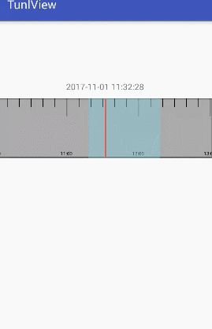
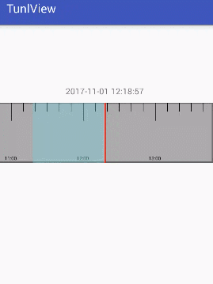

视频播放条控件
======

一个有意思的时间控件！可以通过对控件进行移动（时间变换），可以对控件进行缩放（控件单位长对应时间改变），可以通过时间定位控件位置，也可以通过位置来得到当前时间。该控件可以直接用来做视频播放条使用。控件上的蓝色区域代表拥有录像的时间段

##下载apk

[tunlview.apk](https://gitee.com/wzy901213145499/Tunlview/apks)
	 

## 缩放效果截图

## 滑动效果截图

